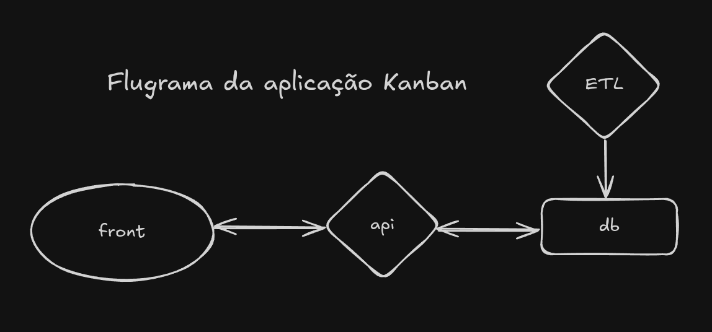

# Introdução

## Objetivo do Sistema

Desenvolver uma solução integrada para gerenciar publicações extraídas do **Diário da Justiça Eletrônico (DJE)** de São Paulo, incluindo:

- Backend para automação de scraping.
- Frontend com interface Kanban para acompanhamento e processamento das publicações.

## Componentes

### Backend
- **Python**: Utilizado para web scraping e automação.
- **Node.js**: Responsável pela API.

### Frontend
- **React**: Framework para desenvolvimento da interface de usuário.

## Funcionalidades

- Extração automatizada de publicações.
- Estruturação e armazenamento no banco de dados.
- Interface responsiva para gerenciamento de publicações.



---

# Backend

## 2.1. Web Scraping

### Ferramentas Utilizadas
- **Python**: Com as bibliotecas:
  - `Selenium`, `requests`, `PyPDF2` para coleta e extração de dados.

### Componentes do Scraper
- **Scraper**: Automatiza o acesso ao site do DJE, aplica filtros e coleta links de PDF.  
  - Arquivo: `scraper.py`
- **PDF Downloader**: Baixa os arquivos PDF encontrados.  
  - Arquivo: `pdf_downloader.py`
- **PDF Data Extractor**: Extrai dados como:
  - Número do processo.
  - Autores.
  - Advogados.
  - Valores monetários.  
  - Arquivo: `pdf_data_extractor.py`

---

## 2.2. Banco de Dados

### Tecnologia
- **MongoDB**: Banco de dados não relacional para armazenamento eficiente de publicações.

### Estrutura de Campos
- **Número do processo**.
- **Data de publicação**.
- **Autores**.
- **Advogados**.
- **Valores**:
  - Bruto.
  - Juros.
  - Honorários.
- **Status do processo**.  
  - Arquivo: `mongodb.py`

---

## 2.3. API

### Tecnologia
- **Node.js** com **Express.js**

### Rotas

#### POST /auth/register
Registra um novo usuário.

**Requisição:**
```json
{
  "fullname": "Nome Completo",
  "email": "usuario@example.com",
  "password": "senhaSegura"
}
```

**Resposta:**
```json
{
  "message": "User registered successfully",
  "token": "<jwt-token>"
}
```

#### POST /auth/login
Autentica um usuário.

**Requisição:**
```json
{
  "email": "usuario@example.com",
  "password": "senhaSegura"
}
```

**Resposta:**
```json
{
  "message": "Login successful",
  "token": "<jwt-token>"
}
```

#### GET /auth/list-cards
Lista todos os processos.

**Cabeçalho:**
```
Authorization: Bearer <jwt-token>
```

**Resposta:**
```json
[
  {
    "process_number": "123456",
    "authors": "João Silva",
    "lawyers": "Maria Oliveira (OAB 1234)",
    "status": "new"
  }
]
```

#### PUT /auth/processes/{id}
Atualiza o status de um processo.

**Requisição:**
```json
{
  "status": "lida"
}
```

**Resposta:**
```json
{
  "_id": "678450185ff6101ca1d0ef40",
  "process_number": "123456",
  "status": "lida"
}
```

---

# Frontend

## 3.1. Funcionalidades

### Tela de Login
- **Autenticação** com validação de credenciais.

### Tela de Cadastro
- **Criação de contas** com validação de senha.

### Kanban
- **Colunas**:
  - Novas.
  - Lidas.
  - Enviadas para ADV.
  - Concluídas.
- **Drag-and-Drop**:
  - Arrastar e soltar publicações para movimentá-las entre colunas.
- **Modal de Detalhes**:
  - Exibição de informações completas de uma publicação.

---

## 3.2. Tecnologias

- **React.js**: Para desenvolvimento de uma interface dinâmica e responsiva.
- **CSS** e **Mateial-UI**: Para estilização moderna e personalizada.

---

## 3.3. Tela Kanban

### Filtros
- **Busca Avançada**:
  - Permite busca por número do processo, autores ou intervalo de datas.
- **Debounce**:
  - Otimiza a performance ao reduzir requisições em tempo real.
- **Resultados Dinâmicos**:
  - Exibição de resultados em tempo real ao alterar os critérios de busca.

### Navbar
- **Logotipo**:
  - Posicionado à esquerda para identidade visual do sistema.
- **Botão de Logout**:
  - Responsivo e alinhado à direita.
  - **Interatividade**:
    - Hover com alteração visual para indicar que o botão é clicável.

---

# Deploy e Configuração

## 4.1. Backend

### Configurar variáveis de ambiente no .env:
- `MONGO_URI`: Conexão ao banco de dados.


## 4.2. Docker

### Configuração:
- Backend e frontend configurados para rodar em contêineres Docker.

### Executar build sem cache:
```bash
docker compose build --no-cache
```

### Aplicar permissão na pasta do MongoDB:
```bash
chmod 777 -R docker/mongodb/
```

### Subir os containers:
```bash
docker compose up -d
```

### Gerenciamento de serviços:
- Configuração no arquivo `docker-compose.yml`.

## 4.3. Execução da ETL

### Processo Inicial:
- A ETL será executada uma única vez após o deploy inicial para processar os dados iniciais.

### Agendamento:
- Execução automática diariamente, às 23h.

---

# Diagrama de Banco de Dados

## 5.1. Estrutura da Coleção de Processos

**Coleção**: `processes`
- `_id` (ObjectId)
- `process_number` (String, único, requerido)
- `authors` (String, requerido)
- `lawyers` (String, requerido)
- `gross_net_principal_amount` (Decimal, requerido)
- `late_interest_amount` (Decimal, requerido)
- `attorney_fees` (Decimal, requerido)
- `defendant` (String, requerido)
- `content` (Text, requerido)
- `status` (String: ["new", "lida", "adv", "concluída"], requerido)
- `availability_date` (Date)
- `created_at` (Datetime, automático)
- `updated_at` (Datetime, automático)

## 5.2. Estrutura da Coleção de Usuários

**Coleção**: `users`
- `_id` (ObjectId)
- `fullname` (String, requerido)
- `email` (String, único, requerido)
- `password` (String, requerido)
- `created_at` (Datetime, automático)
- `updated_at` (Datetime, automático)

---

# 6. Fluxos de Dados

## Web Scraping
- Coleta dados do DJE e salva arquivos PDF no sistema.

## Extração de Dados
- Processa os arquivos PDF coletados e insere os dados extraídos no banco de dados.

## API
- Disponibiliza os dados armazenados no banco para serem consumidos pelo frontend.

## Frontend
- Exibe as publicações em um painel Kanban e permite interação do usuário, como atualização de status.


---

# 7. Resumo

## Coleção Postman
- A coleção Postman com todos os endpoints está disponível na pasta `docs`.

## Projeto
- **JusCash**: Gerenciamento de Publicações DJE.

## Dependências
- **MongoDB**
- **Node.js**
- **Python**
- **React**

## Deploy
- Contêineres Docker para backend e frontend.

## Instruções
1. Instalar dependências.
2. Configurar `.env`.
3. Rodar scripts de backend/frontend.
